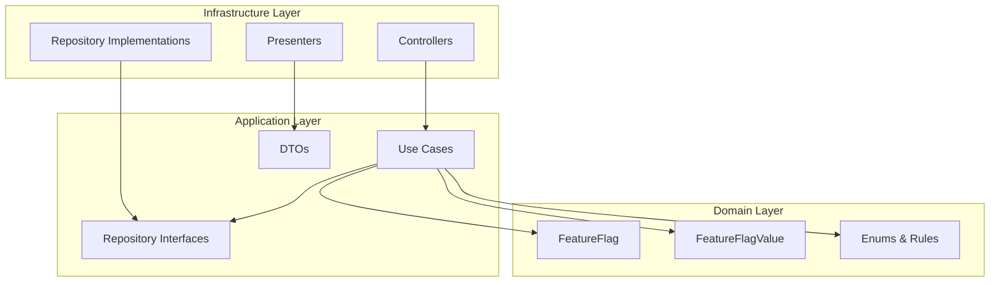
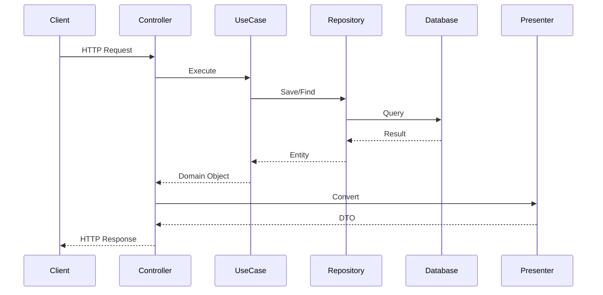
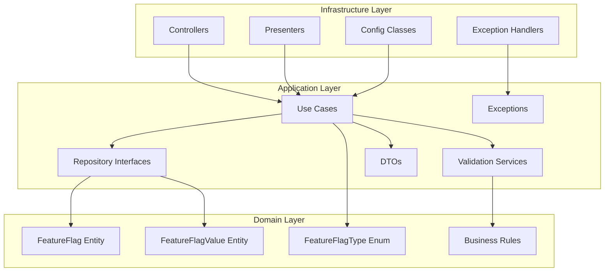
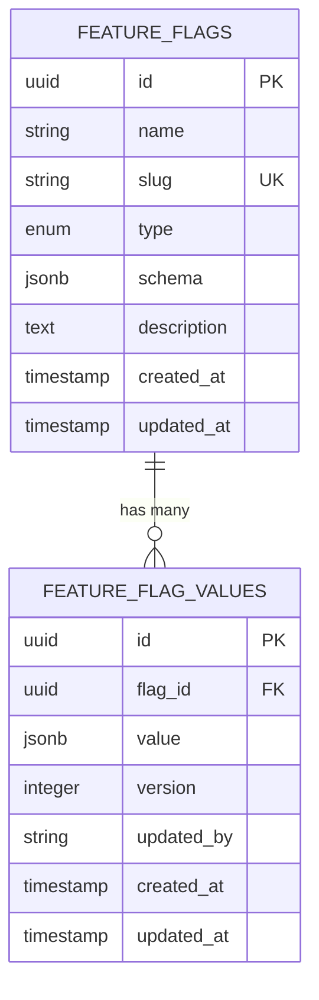

# Arquitetura do Projeto

Documentação da arquitetura do sistema de Feature Flags seguindo Domain-Driven Design (DDD) e Clean Architecture.

## Visão Geral

O projeto segue os princípios de **Domain-Driven Design (DDD)** e **Clean Architecture**, com separação clara de responsabilidades entre as camadas.

## Arquitetura em Camadas

### Diagrama de Camadas



### Diagrama de Fluxo



### Diagrama de Dependências



## Camadas da Arquitetura

### 1. Domain Layer (Núcleo)

**Responsabilidade**: Regras de negócio puras, entidades e lógica central.

**Contém**:

- **Entidades**: `FeatureFlag`, `FeatureFlagValue`
- **Enums**: `FeatureFlagType`
- **Regras de negócio**: Lógica central do domínio

### 2. Application Layer (Orquestração)

**Responsabilidade**: Casos de uso, validações e orquestração de regras de negócio.

**Contém**:

- **Use Cases**: Orquestração de operações de negócio
- **Validation Services**: Validação de dados e schemas
- **Repository Interfaces**: Contratos para persistência
- **DTOs**: Objetos de transferência de dados
- **Exceptions**: Exceções de aplicação

### 3. Infrastructure Layer (Adaptadores)

**Responsabilidade**: Controllers HTTP, configurações e adaptadores externos.

**Contém**:

- **Controllers**: Endpoints REST
- **Presenters**: Conversão de domínio para HTTP
- **Exception Handlers**: Tratamento de erros
- **Configurations**: Configurações da aplicação

## 🔄 Fluxo de Dados

### Criação de Feature Flag

```
HTTP Request → Controller → Use Case → Validation → Repository → Database
     ↓              ↓           ↓           ↓           ↓           ↓
   JSON DTO    Presenter   Business   Schema     JPA/Hibernate PostgreSQL
                (toHttp)    Logic      Validation
```

## Padrões Utilizados

### 1. Domain-Driven Design (DDD)

- **Entidades**: Representam conceitos do domínio
- **Value Objects**: Objetos imutáveis de valor
- **Repositórios**: Abstração de persistência
- **Services**: Lógica de negócio complexa

### 2. Clean Architecture

- **Independência de frameworks**
- **Testabilidade**
- **Independência de UI**
- **Independência de banco de dados**

### 3. Repository Pattern

- Interfaces no application layer
- Implementação via JPA no infrastructure

### 4. Use Case Pattern

- Orquestração de regras de negócio
- Injeção de dependências

### 5. Presenter Pattern

- Conversão de entidades para DTOs
- Separação entre domínio e apresentação

## 🗄️ Modelo de Dados

### Diagrama ER



### Tabelas Principais

#### `feature_flags`

```sql
CREATE TABLE feature_flags (
    id UUID PRIMARY KEY,
    name VARCHAR(255) NOT NULL,
    slug VARCHAR(255) NOT NULL UNIQUE,
    type VARCHAR(50) NOT NULL,
    schema JSONB NOT NULL,
    description TEXT,
    created_at TIMESTAMP NOT NULL,
    updated_at TIMESTAMP NOT NULL
);
```

#### `feature_flag_values`

```sql
CREATE TABLE feature_flag_values (
    id UUID PRIMARY KEY,
    flag_id UUID NOT NULL REFERENCES feature_flags(id),
    value JSONB NOT NULL,
    version INTEGER NOT NULL,
    updated_by VARCHAR(255) NOT NULL,
    created_at TIMESTAMP NOT NULL,
    updated_at TIMESTAMP NOT NULL,
    UNIQUE(flag_id, version)
);
```

## Configurações

### Spring Boot

```yaml
spring:
  application:
    name: feature-flags
  datasource:
    url: jdbc:postgresql://localhost:5432/feature_flags
  jpa:
    hibernate:
      ddl-auto: validate
  redis:
    host: localhost
    port: 6379
```

### Observabilidade

```yaml
management:
  endpoints:
    web:
      exposure:
        include: health,metrics,prometheus
  metrics:
    export:
      prometheus:
        enabled: true
```

## 🔒 Segurança e Validações

### Validações Implementadas

1. **JSON Schema Validation**: Validação automática de schemas
2. **Bean Validation**: Validação de DTOs
3. **Business Rules**: Regras de negócio específicas

### Tratamento de Erros

- **Global Exception Handler**: Tratamento centralizado
- **Custom Exceptions**: Exceções específicas do domínio
- **HTTP Status Codes**: Respostas padronizadas

## Observabilidade

### Métricas

- **Micrometer**: Coleta de métricas
- **Prometheus**: Armazenamento
- **Grafana**: Visualização

### Tracing

- **OpenTelemetry**: Instrumentação
- **Jaeger**: Visualização de traces

### Logs

- **Logback**: Framework de logging
- **Estruturação**: Logs em JSON
- **Correlação**: Trace IDs

## 🔄 Cache Strategy

### Camadas de Cache

1. **Cache Local (Caffeine)**: Performance
2. **Cache Distribuído (Redis)**: Consistência
3. **Invalidação**: Via Redis Pub/Sub

## 🧪 Testes

### Estratégia de Testes

1. **Unit Tests**: Lógica de negócio
2. **Integration Tests**: Repositórios e APIs
3. **End-to-End Tests**: Fluxos completos

### Cobertura

- **Domain**: 100% de cobertura
- **Application**: 90%+ de cobertura
- **Infrastructure**: 80%+ de cobertura

## Performance

### Otimizações

1. **Cache em múltiplas camadas**
2. **Índices otimizados no banco**
3. **Connection pooling**
4. **Async processing** para operações pesadas

### Monitoramento

- **APM**: Application Performance Monitoring
- **Database**: Query performance
- **Cache**: Hit/miss ratios
- **Memory**: Heap usage

## 🔮 Roadmap

### Próximas Melhorias

1. **Versionamento**: Controle de versões de feature flags
2. **Auditoria**: Log de mudanças
3. **Rollout**: Deploy gradual de features
4. **A/B Testing**: Suporte a experimentos
5. **API Gateway**: Rate limiting e autenticação
